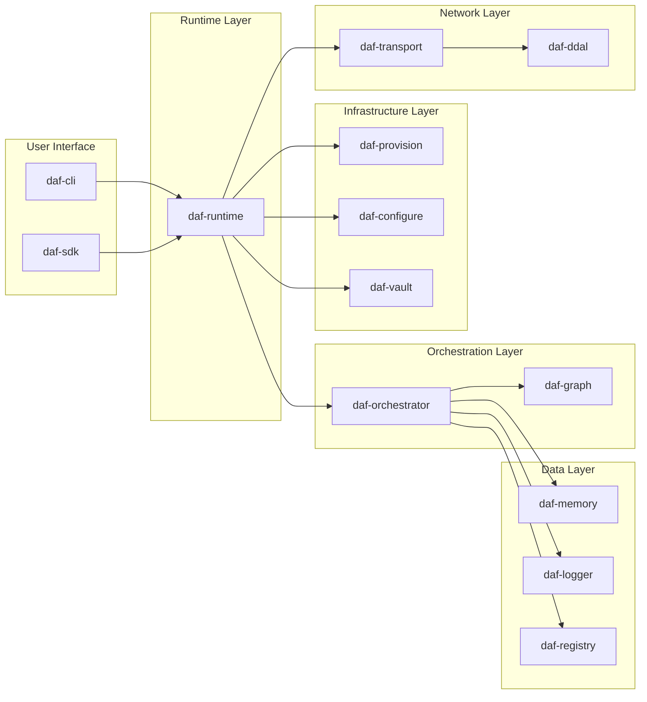
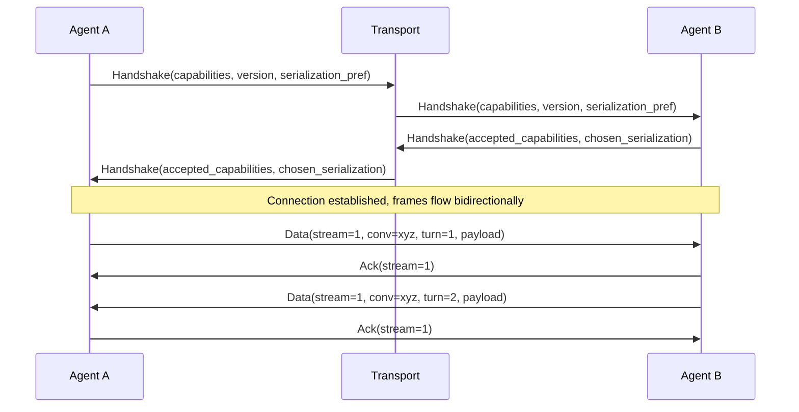
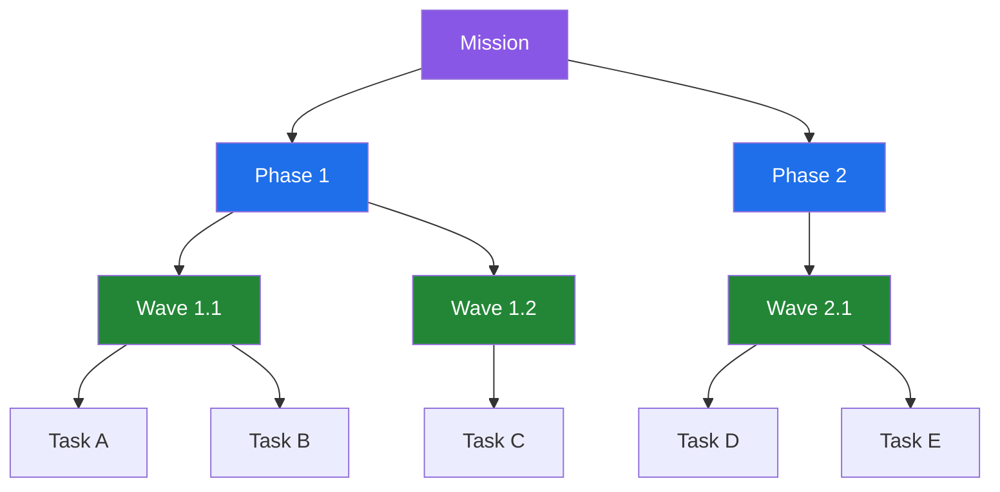
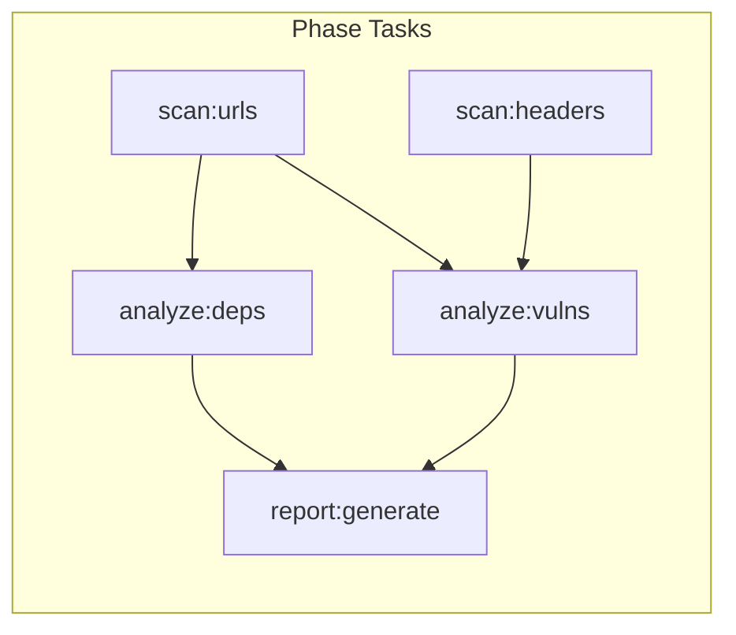
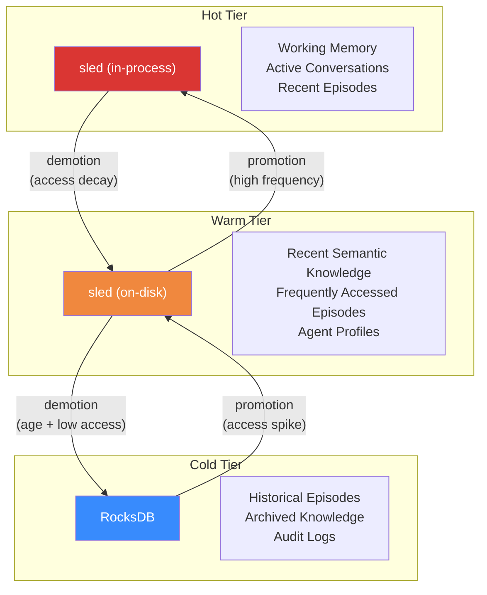
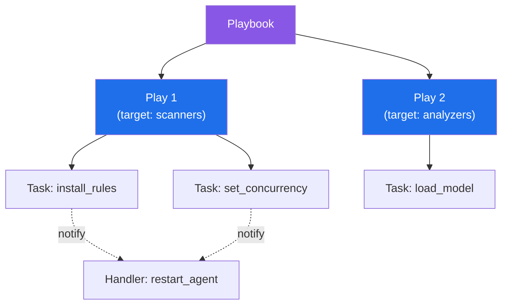
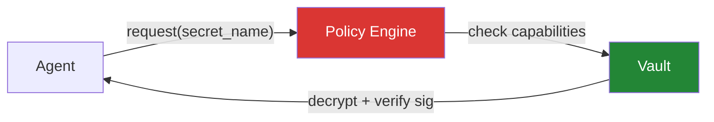

# DAF Architecture

This document describes the internal architecture of DAF — how the components fit together, how data flows through the system, and the design decisions behind each subsystem.

## System Overview

DAF is structured as a Rust workspace with 14 crates. Each crate owns a single concern and communicates with other crates through well-defined trait boundaries. The workspace compiles to a single binary (`daf`) plus a library (`daf-sdk`) for agent developers.



### Component Responsibilities

| Component | Role |
|-----------|------|
| **daf-core** | Shared types (`AgentId`, `MissionId`, `ConversationId`), error types, configuration loading, trait definitions (`Agent`, `Transport`, `Store`) |
| **daf-ddal** | Binary frame codec, serialization/deserialization, protocol state machine |
| **daf-transport** | TCP and TLS connection management, connection pooling, automatic reconnection with exponential backoff |
| **daf-memory** | Three-tier storage engine, episode recording, memory consolidation, semantic search |
| **daf-graph** | DAG construction from task definitions, topological sorting, wave extraction for parallel execution |
| **daf-orchestrator** | Mission lifecycle: plan creation, phase sequencing, wave dispatch, completion tracking |
| **daf-registry** | Agent catalog: registration, deregistration, capability queries, health status |
| **daf-logger** | Structured logging of all agent conversations, turn-level indexing, KB extraction pipeline |
| **daf-provision** | Declarative infrastructure: parse declarations, compute diffs against current state, apply changes |
| **daf-configure** | Playbook execution engine: parse TOML playbooks, resolve variables, execute tasks via modules |
| **daf-vault** | Secret encryption (Blake3), signing (Ed25519), policy-based access control |
| **daf-runtime** | Agent process management: spawn, health monitoring, restart policies, graceful shutdown |
| **daf-cli** | User-facing CLI: `daf init`, `daf plan`, `daf apply`, `daf up`, `daf status`, `daf logs`, `daf send` |
| **daf-sdk** | Public API for agent authors: message handling, memory access, service registration |

---

## DDAL Protocol

DDAL (DAF Direct Agent Link) is the binary wire protocol. It sits below the transport layer and defines how bytes are structured on the wire.

### Frame Format

```
 0                   1                   2                   3
 0 1 2 3 4 5 6 7 8 9 0 1 2 3 4 5 6 7 8 9 0 1 2 3 4 5 6 7 8 9 0 1
+-+-+-+-+-+-+-+-+-+-+-+-+-+-+-+-+-+-+-+-+-+-+-+-+-+-+-+-+-+-+-+-+
|     Magic (0xDA 0xAF)         |   Version     |  Frame Type   |
+-+-+-+-+-+-+-+-+-+-+-+-+-+-+-+-+-+-+-+-+-+-+-+-+-+-+-+-+-+-+-+-+
|                          Stream ID                            |
+-+-+-+-+-+-+-+-+-+-+-+-+-+-+-+-+-+-+-+-+-+-+-+-+-+-+-+-+-+-+-+-+
|                       Payload Length                           |
+-+-+-+-+-+-+-+-+-+-+-+-+-+-+-+-+-+-+-+-+-+-+-+-+-+-+-+-+-+-+-+-+
|     Flags     |   Reserved    |        Conversation ID        |
+-+-+-+-+-+-+-+-+-+-+-+-+-+-+-+-+-+-+-+-+-+-+-+-+-+-+-+-+-+-+-+-+
|                   Conversation ID (cont.)                     |
+-+-+-+-+-+-+-+-+-+-+-+-+-+-+-+-+-+-+-+-+-+-+-+-+-+-+-+-+-+-+-+-+
|                       Turn Number                             |
+-+-+-+-+-+-+-+-+-+-+-+-+-+-+-+-+-+-+-+-+-+-+-+-+-+-+-+-+-+-+-+-+
|                    Checksum (Blake3, 32 bytes)                 |
|                           ...                                 |
+-+-+-+-+-+-+-+-+-+-+-+-+-+-+-+-+-+-+-+-+-+-+-+-+-+-+-+-+-+-+-+-+
|                        Payload ...                            |
+-+-+-+-+-+-+-+-+-+-+-+-+-+-+-+-+-+-+-+-+-+-+-+-+-+-+-+-+-+-+-+-+
```

**Header size:** 56 bytes fixed + variable payload.

### Frame Types

| Type | Value | Description |
|------|-------|-------------|
| Handshake | `0x01` | Connection establishment, capability negotiation |
| Data | `0x02` | Application-level message payload |
| Ack | `0x03` | Acknowledgment of received frame |
| Nack | `0x04` | Negative acknowledgment, request retransmission |
| Ping | `0x05` | Keepalive probe |
| Pong | `0x06` | Keepalive response |
| Route | `0x07` | Routing table update |
| Subscribe | `0x08` | Subscribe to a topic/channel |
| Unsubscribe | `0x09` | Unsubscribe from a topic/channel |
| Close | `0x0A` | Graceful connection teardown |

### Handshake Flow



During handshake, agents negotiate:
1. **Protocol version** — must be compatible
2. **Capabilities** — intersection of what both sides support
3. **Serialization format** — Bincode (fastest), MessagePack (interop), or JSON (debug)
4. **Compression** — optional LZ4 frame compression

### Channel Multiplexing

A single TCP connection carries multiple logical streams identified by `stream_id`. Each stream is an independent ordered byte channel. This avoids head-of-line blocking across conversations and eliminates the overhead of multiple TCP connections.

Streams are created implicitly on first use and torn down when both sides send Close frames for that stream.

---

## Execution Model

DAF organizes work in a four-level hierarchy:



### Mission

A mission is the top-level unit of work. It has a goal, a set of assigned agents, and success criteria. Missions are created by the user (via CLI or SDK) or by the orchestrator in response to higher-level directives.

### Phase

Phases are sequential stages within a mission. Phase 2 does not start until Phase 1 completes. Each phase has its own resource allocation and can add or remove agents.

### Wave

Waves are the unit of parallelism. Within a phase, the orchestrator analyzes task dependencies using `daf-graph`, builds a DAG, and extracts waves — sets of tasks with no mutual dependencies that can execute concurrently.

### Task

A task is an atomic unit of work assigned to a single agent. Tasks declare their inputs, outputs, and dependencies. The orchestrator tracks completion and routes outputs to dependent tasks.

### DAG Construction



The graph engine extracts three waves from this DAG:
- **Wave 1:** `scan:urls`, `scan:headers` (no dependencies, run in parallel)
- **Wave 2:** `analyze:vulns`, `analyze:deps` (depend on Wave 1)
- **Wave 3:** `report:generate` (depends on Wave 2)

---

## Memory Architecture

DAF implements a three-tier memory system optimized for different access patterns.



### Tiers

| Tier | Backend | Latency Target | Contents |
|------|---------|----------------|----------|
| Hot | sled (memory-mapped) | < 1ms | Working memory, active conversations, recent episodes |
| Warm | sled (disk-backed) | < 10ms | Semantic knowledge, frequently accessed episodes, agent state |
| Cold | RocksDB | < 100ms | Historical episodes, archived knowledge, full audit logs |

### Memory Types

- **Episodic** — Records of specific events: conversations, task executions, observations. Timestamped, attributed to an agent, linked to a mission.
- **Semantic** — Consolidated knowledge derived from episodes. Facts, patterns, learned preferences. Produced by the consolidation pipeline.
- **Procedural** — How-to knowledge: workflows that worked, parameter combinations that produced good results, recovery strategies.
- **Working** — Transient state for currently active operations. Evicted when the operation completes.

### Tier Movement

Memories move between tiers based on access frequency and recency:
- **Promotion:** A cold memory accessed 3+ times in 24 hours moves to warm. A warm memory accessed 10+ times in 1 hour moves to hot.
- **Demotion:** A hot memory not accessed for 1 hour moves to warm. A warm memory not accessed for 24 hours moves to cold.
- **Decay:** Access scores decay exponentially with a half-life of 6 hours.

Full specification: [docs/MEMORY.md](docs/MEMORY.md)

---

## Provisioning Model

Provisioning follows a declare-plan-apply-state lifecycle, similar to Terraform.

```mermaid
stateDiagram-v2
    [*] --> Declare
    Declare --> Plan
    Plan --> Apply
    Apply --> State
    State --> Declare: drift detected

    Declare: Parse agent declarations\nfrom TOML files
    Plan: Diff desired vs current state\nGenerate change set
    Apply: Execute changes\nSpawn/configure/connect agents
    State: Persist current state\nto state file
```

### Declaration Format

```toml
[agents.scanner]
runtime = "python"
entry = "scan.py"
replicas = 2
memory_tier = "hot"
capabilities = ["network", "filesystem.read"]
depends_on = ["registry"]

[agents.analyzer]
runtime = "rust"
entry = "analyze"
replicas = 1
memory_tier = "warm"
capabilities = ["compute"]
depends_on = ["scanner"]

[connections]
scanner_to_analyzer = { from = "scanner", to = "analyzer", protocol = "ddal" }
```

### State Management

DAF writes a `daf.state` file (JSON) after every apply. This file records exactly what was provisioned — agent IDs, connection endpoints, resource allocations. On the next `daf plan`, the engine diffs the desired state (declarations) against the current state (state file) and produces a minimal change set.

---

## Configuration Model

Configuration follows an Ansible-inspired playbook model for setting up agent behaviors after provisioning.



### Playbook Structure

```toml
[[plays]]
name = "Configure scanner fleet"
targets = ["scanners"]

[[plays.tasks]]
name = "Set scan rules"
module = "config"
params = { key = "scan.rules_path", value = "/rules/owasp.yaml" }
notify = ["restart"]

[[plays.tasks]]
name = "Set concurrency"
module = "config"
params = { key = "scan.concurrency", value = "8" }

[[plays.handlers]]
name = "restart"
module = "lifecycle"
params = { action = "restart", grace_period = "5s" }
```

### Idempotency

Every module is idempotent. Running a playbook twice produces the same result. Modules report `changed` or `ok` status — handlers only fire when at least one notifying task reports `changed`.

---

## Security Model

### Vault

The vault stores secrets encrypted at rest using Blake3-derived keys. Secrets are signed with Ed25519 keypairs to detect tampering.



### Access Policies

Policies are capability-based. An agent can only access a secret if:
1. The agent's declared capabilities include the secret's required capability
2. The agent is a member of an authorized group
3. The request originates from within a valid mission context

### Message Signing

All DDAL Data frames can optionally carry Ed25519 signatures. When enabled, the receiving agent verifies the signature against the sender's registered public key before processing the message. This prevents agent impersonation.

### Transport Encryption

All inter-agent connections use TLS 1.3 via rustls. Certificate management is handled by the runtime — agents don't deal with TLS directly.

---

## Performance Targets

| Metric | Target |
|--------|--------|
| DDAL frame encode/decode | < 500ns per frame |
| Hot memory read | < 1ms p99 |
| Warm memory read | < 10ms p99 |
| Cold memory read | < 100ms p99 |
| Agent spawn time | < 50ms |
| Wave dispatch latency | < 5ms |
| Throughput (single connection) | > 100K frames/sec |
| Concurrent connections | > 10K per runtime instance |

Benchmarks live in the `benchmarks/` directory and run on every CI build.
