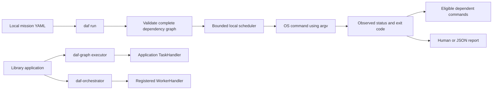

# DAF architecture

DAF is a Rust 2024 workspace by **Darshankumar Joshi**: 14 library/CLI crates, plus benchmark and integration-test workspace members. It is experimental infrastructure for agent applications. The complete distributed controller described by earlier design documents is not implemented.

## Actual execution paths

```mermaid
flowchart LR
  YAML[Local mission YAML] --> CLI[daf run]
  CLI --> Validate[Validate complete dependency graph]
  Validate --> Schedule[Bounded local scheduler]
  Schedule --> Child[OS command using argv]
  Child --> Result[Observed status and exit code]
  Result --> Dependent[Eligible dependent commands]
  Result --> Report[Human or JSON report]
  App[Library application] --> Graph[daf-graph executor]
  Graph --> Handler[Application TaskHandler]
  App --> Orch[daf-orchestrator]
  Orch --> Worker[Registered WorkerHandler]
```

The CLI scheduler is independent of `daf-graph`; the library and command path are tested separately. Local execution does not use DDAL, remote discovery or model inference. Applications supply task handlers and integrations. `AgentInstance` runs registered SDK handlers locally; its configuration fields do not prove it connects all runtime services.

## Components and integration boundaries

| Crate | Implemented building blocks | Boundary |
| :--- | :--- | :--- |
| `daf-core` | Identity, task/message, configuration and error types | Identity values are not authentication. |
| `daf-graph` | DAG validation, planning, conditional execution, handler deadlines | Application supplies execution and output interpretation. |
| `daf-orchestrator` | Agent registration/routing, registered worker execution, mission types | Worker registration is required; durable distributed workflow recovery is absent. |
| `daf-sdk` | Builder, handlers, middleware and local lifecycle | Remote SDK-to-runtime integration remains work. |
| `daf-ddal` | Frame codec, payload serialization, channels, routing and conversation types | Wire framing is separate from model context and remote execution. |
| `daf-transport` | TCP, Unix/in-process and TLS connection components | Applications configure and connect secure transport explicitly. |
| `daf-registry` | Registration, lookup and heartbeat bookkeeping | Registration alone does not establish a healthy remote worker. |
| `daf-runtime` | Lifecycle, TCP listener, shutdown, peer/health/metrics types | Several subsystem boot paths remain scaffolding and must not report readiness. |
| `daf-memory` | In-memory, Sled and RocksDB stores, filtered/ranked recall, tier metadata, consolidation heuristics | No embedding index or trained semantic inference; one manager wraps one store. |
| `daf-logger` | Conversation record storage/query, episodes and extraction helpers | Application must wire logging into real execution. |
| `daf-vault` | AES-256-GCM envelope encryption, PBKDF2 master key, Sled records | Secret storage is not general tool authorization. |
| `daf-provision` | Declarations, planning/state/backend abstractions | CLI apply/destroy requires a connected implementation and fails explicitly. |
| `daf-configure` | Playbook, variables/module abstractions | CLI execution is unavailable; check is static inspection. |
| `daf` | Local missions, vault and scaffold/preview commands | Cluster operations fail explicitly. |

## Network and trust

DDAL has a **21-byte header**, not the 24- or 56-byte layouts in the previous documents. Its four-byte truncated checksum detects corruption; it does not authenticate the sender. Conversation identifiers belong to payload/application structures, not every frame header. See [the wire specification](docs/DDAL.md).

TLS components support certificate verification and optional mutual TLS when configured with a CA. Plain TCP remains available. Authentication policy, principal-to-agent binding and authorization must be enforced by the integrating application; a claimed name or handshake token field is not sufficient evidence of authentication.

## Persistence and recovery

Memory backends store serialized typed memories. Tier labels and manager policies do not implement automatic migration among three independent physical databases. Recall currently scans candidates and applies filters/ranking. Consolidation uses deterministic content heuristics; applications must not treat generated summaries as verified facts.

The local vault derives a master key using PBKDF2-HMAC-SHA256 with 600,000 iterations and a random salt, then wraps per-secret random data keys using AES-256-GCM. The CLI persists an encrypted verification record and rejects wrong passwords. Preserve backups and recovery credentials outside source control.

Durable distributed mission journals, effect idempotency, model-provider orchestration, sandboxed tool execution and crash recovery are **future integration requirements**, not implicit properties of the current libraries. The [advanced agent systems standard](docs/STANDARD.md) defines acceptance gates.

## Validation

Use locked local commands from [CONTRIBUTING.md](CONTRIBUTING.md). GitHub Actions is disabled. Benchmarks measure their named components; no hardware-independent throughput or latency guarantee is claimed.
