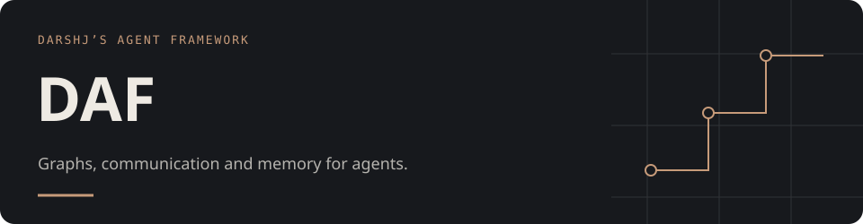
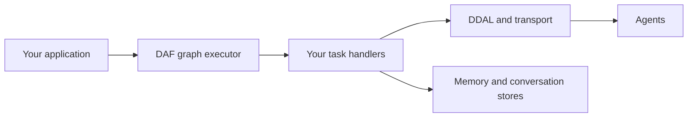

# Darshj’s Agent Framework

**Rust building blocks for coordinating agents: what runs, how agents communicate, and what they remember.**

DAF brings task graphs, a binary communication protocol, memory stores and orchestration types into one workspace. You can work with the libraries directly and supply the task handlers and integrations your system needs.

**Status: early development, v0.1.0.** The libraries and the CLI are at different stages. The CLI executes local command missions and stores encrypted secrets. Cluster operations require a connected backend and fail explicitly when unavailable; see [implementation status](#implementation-status) before using the CLI for operational work.

[DDAL protocol](docs/DDAL.md) · [Memory design](docs/MEMORY.md) · [Source](crates/) · [Apache 2.0](LICENSE)

## The building blocks

| Area | Crates | Purpose |
| :--- | :--- | :--- |
| Execution | [`daf-graph`](crates/daf-graph/), [`daf-orchestrator`](crates/daf-orchestrator/) | Dependency graphs, execution waves, task handlers and mission structure. |
| Communication | [`daf-ddal`](crates/daf-ddal/), [`daf-transport`](crates/daf-transport/) | Binary frames, serialization, channels, conversations and transport components. |
| Memory | [`daf-memory`](crates/daf-memory/), [`daf-logger`](crates/daf-logger/) | Memory stores, episodes, recall, consolidation and conversation records. |
| Agent interfaces | [`daf-core`](crates/daf-core/), [`daf-sdk`](crates/daf-sdk/), [`daf-registry`](crates/daf-registry/) | Shared types, agent construction, registration and discovery. |
| Runtime and operations | [`daf-runtime`](crates/daf-runtime/), [`daf-provision`](crates/daf-provision/), [`daf-configure`](crates/daf-configure/), [`daf-vault`](crates/daf-vault/) | Lifecycle, topology planning, configuration and secret-store implementations. |

DDAL provides a Tokio frame codec, stream identifiers, checksums, channel multiplexing and conversation tracking. Payload serializers include Bincode, MessagePack and JSON. The graph executor schedules work subject to dependencies and concurrency limits, with timeout, cancellation and failure handling.

These are separate components. Your integration connects them; the diagram below is a typical composition, not a claim that every CLI path already does so.



## Start from source

Use Rust **1.85 or newer** with Cargo. The workspace uses the 2024 edition.

```sh
git clone https://github.com/darshjme/daf.git
cd daf

# Explore the core components without building every subsystem.
cargo test --locked -p daf-core -p daf-ddal -p daf-graph
cargo doc --locked -p daf-graph -p daf-ddal --no-deps --open
```

For the complete workspace:

```sh
cargo test --locked --workspace
```

The full workspace includes native storage dependencies such as RocksDB and may require a C/C++ toolchain, CMake and libclang. The commands above are local verification commands; GitHub Actions is disabled.

### A small dependency graph

```rust
use daf_graph::{Edge, EdgeKind, ExecutionGraph, Node, NodeKind, WaveScheduler};

let mut graph = ExecutionGraph::new("inspect-change-verify");
let inspect = graph.add_node(Node::new(NodeKind::Task, "inspect"));
let change = graph.add_node(Node::new(NodeKind::Task, "change"));
let verify = graph.add_node(Node::new(NodeKind::Task, "verify"));

graph.add_edge(Edge::new(inspect, change, EdgeKind::DependsOn))?;
graph.add_edge(Edge::new(change, verify, EdgeKind::DependsOn))?;

let plan = WaveScheduler::new().plan_waves(&graph)?;
assert_eq!(plan.waves.len(), 3);
```

This builds a plan. To execute work, implement [`TaskHandler`](crates/daf-graph/src/executor.rs) and use `GraphExecutor`. The graph library can also export DOT and Mermaid representations.

## Local execution

Build `cargo build --locked -p daf`, then run a mission:

```yaml
mission:
  name: local-checks
  tasks:
    - name: inspect
      agent: local
      params:
        command: ["git", "status", "--short"]
    - name: verify
      agent: local
      depends_on: [inspect]
      params:
        command: ["cargo", "test", "--locked", "-p", "daf-graph"]
```

Save this in the project directory and run `daf run mission.yml --yes --parallelism 4 --timeout 300`.
Commands use argv directly, without an implicit shell. Paths resolve from the mission directory;
`params.cwd` selects a different working directory. The entire graph is checked before execution.
Failed dependencies prevent downstream commands from running. Timeout terminates the direct command;
commands that spawn detached descendants must manage their own process lifecycle.

`daf vault init`, `set`, `get`, `list`, and `rotate` use encrypted Sled storage in `.daf/vault`.
The master password is prompted without echo; automation can supply `DAF_VAULT_PASSWORD` and
`DAF_VAULT_DIR`. Values are hidden unless `get --raw` is requested. Initialization refuses an existing path.

## Implementation status

Local missions and vault operations perform real work. `init`, `configure check` and `provision plan`
provide local scaffolding or static previews. Cluster agent control, cluster status, conversation logs,
provisioning apply/destroy and configuration execution return explicit unsupported errors. They do not
invent agents, resources, logs or successful execution.

The runtime libraries still need integration work for a distributed deployment. This release does not
claim a production-ready cluster controller. Verify locally with:

```sh
cargo test --locked -p daf --lib
cargo build --locked -p daf
python3 scripts/check_local_cli.py
```
