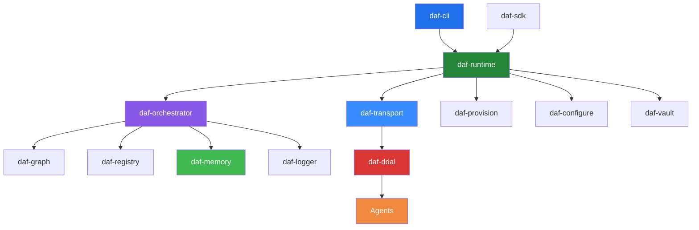

# DAF — Darshj's Agent Framework

**A unified infrastructure layer for orchestrating AI agents. Binary communication, episodic memory, DAG execution, declarative provisioning — everything agents need to work together, built in Rust.**

[](LICENSE)
[](https://www.rust-lang.org)
[](https://crates.io/crates/daf)
[](https://github.com/darshjme/daf/actions/workflows/ci.yml)

---

## What is DAF

DAF is an operating system for AI agents. It handles the hard infrastructure problems — how agents find each other, how they communicate efficiently, how they remember what happened, how they coordinate work across complex task graphs — so you can focus on what your agents actually do. Think of it as Kubernetes for agents: a runtime, a scheduler, a network layer, and a state store, all designed from scratch for agentic workloads.

## Why DAF Exists

I grew up on open-source. The community taught me everything. AI agents helped me ship faster, think clearer, build bigger. But agents today are disconnected — they can't talk to each other, can't remember what they learned, can't coordinate on complex work.

DAF gives agents a proper operating system. Binary communication (DDAL), episodic memory, sprint-based orchestration, declarative provisioning. If Ansible configures servers and Terraform provisions infrastructure, DAF does both — for agents.

This is my payback to the community that raised me.

*— [Darshankumar Joshi](https://darshj.ai)*

## Architecture



## Key Features

**DDAL Binary Protocol** — Custom binary socket protocol purpose-built for agent-to-agent communication. Frame-level multiplexing, conversation tracking, and three serialization formats (Bincode, MessagePack, JSON). Sub-millisecond overhead. See [docs/DDAL.md](docs/DDAL.md).

**Episodic Memory** — Three-tier memory system (hot/warm/cold) with automatic promotion and demotion. Agents record episodes, consolidate them into semantic knowledge, and recall relevant context on demand. Built on sled and RocksDB. See [docs/MEMORY.md](docs/MEMORY.md).

**DAG Execution** — Work is organized as missions containing phases, phases containing waves, waves containing tasks. The orchestrator builds a directed acyclic graph from task dependencies and executes waves in parallel using petgraph.

**Terraform-style Provisioning** — Declare what agents you need, what resources they require, and what connections exist between them. DAF plans the delta, applies it, and tracks state. `daf plan` shows you what will change. `daf apply` makes it happen.

**Ansible-style Configuration** — Playbooks describe how agents should be configured. Plays target agent groups, tasks invoke modules, handlers react to changes. Idempotent by design.

**Vault Secrets** — Ed25519-signed, Blake3-hashed secret storage. Agents request secrets through capability-based access policies. No plaintext on disk, ever.

**Conversation Logging and KB Extraction** — Every agent conversation is logged with full turn-level detail. The logger extracts structured knowledge base entries from conversation patterns, building a searchable corpus that agents can query.

## Quick Start

### Install

```bash
cargo install daf
```

### Initialize a project

```bash
daf init my-agent-system
cd my-agent-system
```

### Define your agents

```toml
# agents/scanner.toml
[agent]
name = "scanner"
runtime = "python"
entry = "scan.py"

[agent.memory]
tier = "hot"
capacity = "256MB"

[agent.capabilities]
network = true
filesystem = ["read"]
```

### Provision and run

```bash
# See what will be created
daf plan

# Apply the configuration
daf apply

# Launch the system
daf up

# Check agent status
daf status
```

### Send a message between agents

```bash
daf send scanner --message '{"target": "https://example.com", "depth": 3}'
```

### Watch conversations in real time

```bash
daf logs --follow --agent scanner
```

## DDAL Protocol

DDAL (DAF Direct Agent Link) is the binary wire protocol that agents use to communicate. It replaces JSON-over-HTTP with a compact binary frame format optimized for high-frequency, low-latency agent messaging.

Key design decisions:
- **Binary frames** with magic bytes, type tags, stream IDs, and Blake3 checksums
- **Channel multiplexing** — multiple logical conversations over a single TCP connection
- **Conversation-native** — every frame carries a conversation ID and turn number, so the system can reconstruct full dialogues for analysis and KB extraction
- **Three serialization tiers** — Bincode for speed, MessagePack for interoperability, JSON for debugging

Full specification: [docs/DDAL.md](docs/DDAL.md)

## Crate Map

| Crate | Description | Status |
|-------|-------------|--------|
| `daf-core` | Shared types, traits, error types, and configuration primitives |  |
| `daf-ddal` | DDAL binary protocol: frame codec, serialization, handshake |  |
| `daf-transport` | TCP/TLS transport layer, connection pooling, reconnection |  |
| `daf-memory` | Three-tier episodic memory system (sled + RocksDB) |  |
| `daf-graph` | DAG construction and wave-parallel execution engine |  |
| `daf-orchestrator` | Mission/phase/wave lifecycle management |  |
| `daf-registry` | Agent registration, discovery, and health checking |  |
| `daf-logger` | Structured conversation logging and KB extraction |  |
| `daf-provision` | Terraform-style declarative agent provisioning |  |
| `daf-configure` | Ansible-style playbook-based agent configuration |  |
| `daf-vault` | Secret management with Ed25519 signing and access policies |  |
| `daf-runtime` | Agent lifecycle runtime: spawn, monitor, restart, teardown |  |
| `daf-cli` | Command-line interface for all DAF operations |  |
| `daf-sdk` | Rust SDK for building agents that run on DAF |  |

## Examples

The `examples/` directory contains working configurations:

- **[basic-agent](examples/basic-agent/)** — Single agent with memory and logging
- **[multi-agent](examples/multi-agent/)** — Multiple agents communicating over DDAL
- **[infrastructure](examples/infrastructure/)** — Full provisioning and configuration setup
- **[configuration](examples/configuration/)** — Ansible-style playbook examples

Run any example:

```bash
cd examples/basic-agent
daf apply && daf up
```

## Documentation

- [Architecture](ARCHITECTURE.md) — System design, component interactions, execution model
- [DDAL Protocol](docs/DDAL.md) — Wire protocol specification
- [Memory System](docs/MEMORY.md) — Three-tier memory architecture
- [Contributing](CONTRIBUTING.md) — Development setup, PR process, code style

## Contributing

DAF is open source under the Apache 2.0 license. Contributions are welcome — see [CONTRIBUTING.md](CONTRIBUTING.md) for the full guide.

The short version: fork, branch from `main`, write tests, run `cargo fmt` and `cargo clippy`, open a PR.

## License

Apache 2.0 — see [LICENSE](LICENSE) for the full text.

---

Built by [Darshankumar Joshi](https://darshj.ai) | [GitHub](https://github.com/darshjme) | [Documentation](https://docs.daf.darshj.ai)
