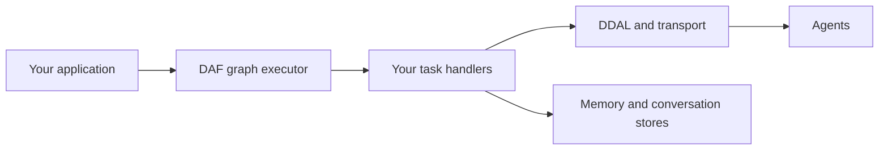

# Darshj’s Agent Framework

**Rust building blocks for coordinating agents: what runs, how agents communicate, and what they remember.**

DAF brings task graphs, a binary communication protocol, memory stores and orchestration types into one workspace. You can work with the libraries directly and supply the task handlers and integrations your system needs.

**Status: early development, v0.1.0.** The libraries and the CLI are at different stages. Several CLI commands still demonstrate intended behavior instead of invoking the underlying subsystem. Start with the libraries; see [implementation status](#implementation-status) before using the CLI for operational work.

[DDAL protocol](docs/DDAL.md) · [Memory design](docs/MEMORY.md) · [Source](crates/) · [Apache 2.0](LICENSE)

## The building blocks

| Area | Crates | Purpose |
| :--- | :--- | :--- |
| Execution | [`daf-graph`](crates/daf-graph/), [`daf-orchestrator`](crates/daf-orchestrator/) | Dependency graphs, execution waves, task handlers and mission structure. |
| Communication | [`daf-ddal`](crates/daf-ddal/), [`daf-transport`](crates/daf-transport/) | Binary frames, serialization, channels, conversations and transport components. |
| Memory | [`daf-memory`](crates/daf-memory/), [`daf-logger`](crates/daf-logger/) | Memory stores, episodes, recall, consolidation and conversation records. |
| Agent interfaces | [`daf-core`](crates/daf-core/), [`daf-sdk`](crates/daf-sdk/), [`daf-registry`](crates/daf-registry/) | Shared types, agent construction, registration and discovery. |
| Runtime and operations | [`daf-runtime`](crates/daf-runtime/), [`daf-provision`](crates/daf-provision/), [`daf-configure`](crates/daf-configure/), [`daf-vault`](crates/daf-vault/) | Lifecycle, topology planning, configuration and secret-store implementations. |

DDAL provides a Tokio frame codec, stream identifiers, checksums, channel multiplexing and conversation tracking. Payload serializers include Bincode, MessagePack and JSON. The graph executor schedules work subject to dependencies and concurrency limits, with timeout, cancellation and failure handling.

These are separate components. Your integration connects them; the diagram below is a typical composition, not a claim that every CLI path already does so.



## Start from source

Use Rust **1.85 or newer** with Cargo. The workspace uses the 2024 edition.

```sh
git clone https://github.com/darshjme/daf.git
cd daf

# Explore the core components without building every subsystem.
cargo test --locked -p daf-core -p daf-ddal -p daf-graph
cargo doc --locked -p daf-graph -p daf-ddal --no-deps --open
```

For the complete workspace:

```sh
cargo test --locked --workspace
```

The full workspace includes native storage dependencies such as RocksDB and may require a C/C++ toolchain, CMake and libclang. The commands above are local verification commands; GitHub Actions is disabled.

### A small dependency graph

```rust
use daf_graph::{Edge, EdgeKind, ExecutionGraph, Node, NodeKind, WaveScheduler};

let mut graph = ExecutionGraph::new("inspect-change-verify");
let inspect = graph.add_node(Node::new(NodeKind::Task, "inspect"));
let change = graph.add_node(Node::new(NodeKind::Task, "change"));
let verify = graph.add_node(Node::new(NodeKind::Task, "verify"));

graph.add_edge(Edge::new(inspect, change, EdgeKind::DependsOn))?;
graph.add_edge(Edge::new(change, verify, EdgeKind::DependsOn))?;

let plan = WaveScheduler::new().plan_waves(&graph)?;
assert_eq!(plan.waves.len(), 3);
```

This builds a plan. To execute work, implement [`TaskHandler`](crates/daf-graph/src/executor.rs) and use `GraphExecutor`. The graph library can also export DOT and Mermaid representations.

## Implementation status

The codebase contains implementations of the graph engine, DDAL codec, memory stores and supporting libraries. It is not yet a complete distributed agent platform.

- **CLI integration:** agent operations, mission execution, provisioning and configuration still contain demonstration paths. [`daf status`](crates/daf-cli/src/commands/status.rs) is not a live cluster inventory.
- **Vault CLI:** [`vault get`](crates/daf-cli/src/commands/vault.rs) returns a placeholder; it is not wired to the encrypted store. The vault library is separate from this command.
- **Distributed runtime:** node join/leave transport and live configuration reload remain incomplete in [`daf-runtime`](crates/daf-runtime/src/).
- **Examples:** [`examples/`](examples/) contains code and configuration references. It is not a validated deployment catalogue.

Read these paths before treating a successful CLI message as evidence that an operation occurred. Performance claims need a reproducible workload; there is no universal latency or speedup guarantee here.

## Explore and contribute

Start with the [graph API](crates/daf-graph/src/lib.rs), [DDAL codec](crates/daf-ddal/src/codec.rs), [memory manager](crates/daf-memory/src/manager.rs), or [Rust SDK](crates/daf-sdk/src/lib.rs). Contributions that connect a command to real execution, add a focused regression test, or improve protocol documentation are useful starting points.

Created and maintained by **[Darshankumar Joshi](https://github.com/darshjme)**. Licensed under [Apache 2.0](LICENSE).
