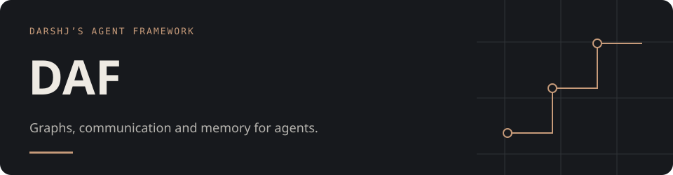
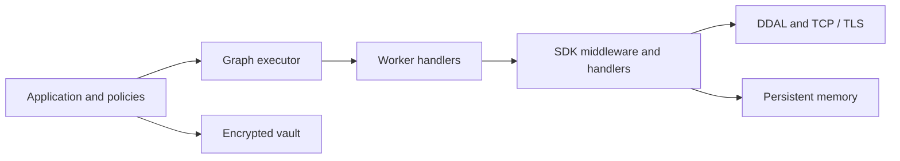

# Darshj’s Agent Framework

**An evidence-driven Rust foundation for agent execution, communication and memory.**
Created by **Darshankumar Joshi** · Apache 2.0 · early development, v0.1.0

DAF makes agent infrastructure inspectable: dependency graphs, bounded execution, typed messages, encrypted secrets and persistent records. Applications supply their models, handlers and policies. Our ambition is advanced autonomous systems; our claims are limited to behavior demonstrated by code and tests.

[Engineering standard](docs/STANDARD.md) · [Audit and remaining gaps](docs/AUDIT-2026-10-06.md) · [Architecture](ARCHITECTURE.md) · [Runnable examples](examples/README.md) · [DDAL](docs/DDAL.md) · [Memory](docs/MEMORY.md)

## Run your first mission

Rust 2024 edition; declared minimum Rust 1.85. The full workspace also requires a C/C++ toolchain, CMake and libclang for native storage dependencies.

```sh
git clone https://github.com/darshjme/daf.git
cd daf
cargo build --locked -p daf
mkdir demo && cd demo
../target/debug/daf init --name demo --yes
../target/debug/daf run mission.yml --yes
```

`init` creates a runnable local mission and refuses to overwrite existing project files. Commands use explicit argv; no shell is inserted.

```yaml
mission:
  name: inspect-and-verify
  tasks:
    - name: inspect
      agent: local
      params:
        command: ["git", "status", "--short"]
    - name: verify
      agent: local
      depends_on: [inspect]
      params:
        command: ["cargo", "test", "--locked", "-p", "daf-graph"]
```

Save this mission in the repository and run `target/debug/daf run mission.yml --yes --parallelism 4 --timeout 300`. Working directories resolve from the mission file. The complete graph and directories are validated before execution; failed dependencies are skipped. `--format json` produces ordered task outcomes on stdout, with command output on stderr. Timeouts terminate and reap the direct child; detached descendants remain the command’s responsibility.

## Compose the libraries


```mermaid
flowchart LR
    Application[Application and policies] --> Graph[Graph executor]
    Graph --> Orchestrator[Worker handlers]
    Orchestrator --> SDK[SDK middleware and handlers]
    SDK --> Transport[DDAL and TCP / TLS]
    SDK --> Memory[Persistent memory]
    Application --> Vault[Encrypted vault]
```

This is an application composition. The runtime does not automatically connect every component into a distributed control plane.

| Component | Demonstrated behavior | Boundary |
| :--- | :--- | :--- |
| Graph / orchestrator / SDK | Real handler execution, conditional recovery, admission limits, cancellation, middleware and deadlines | Output-dependent routing fails explicitly until implemented |
| DDAL / transport | Bounded frame codec, checksums, explicit channel pumping, TCP and opt-in mutual TLS | Checksums do not authenticate peers; remote worker supplies scoped credential authorization |
| Memory / logger | In-memory, Sled and RocksDB stores; filtered recall; heuristic consolidation; rotation | No embeddings, learned cognition or cross-store transactions |
| Vault | AES-256-GCM encrypted Sled secrets, password rejection, persistent rotation | Low-level access policies require application enforcement |
| CLI | Local missions, vault operations, initialization and static previews | Cluster control and apply operations report unsupported errors |
| Runtime / registry | Lifecycle, shutdown, discovery and truthful unknown subsystem health | Authenticated durable remote worker available; no fleet scheduler or consensus |

Run the [authenticated durable remote example](docs/REMOTE.md) to persist results, retry stable task IDs after restart, and feed recovered outputs into dependent tasks.

The [standard](docs/STANDARD.md) defines 22 measurable requirements across execution, security, memory, distribution, observation, models and developer experience. It is a project acceptance contract, with per-path evidence levels. Passing component tests does not establish AGI or ASI.

## Verify locally

```sh
cargo fmt --all --check
cargo clippy --locked --workspace --all-targets -- -D warnings
cargo test --locked --workspace
cargo doc --locked --workspace --no-deps
cargo build --locked -p daf
python3 scripts/check_local_cli.py
```

Integration tests exercise exported graph → orchestrator → SDK execution and loopback TCP → DDAL → SDK → persistent Sled reopen, including rejection paths. A separate worker-process acceptance test uses SIGKILL after durable commit, then checks authenticated replay and dependent execution after restart. See the dated audit for actual results and limitations. GitHub Actions is disabled; verification runs locally.

`daf vault init`, `set`, `get`, `list` and `rotate` operate on `.daf/vault`. Password entry is hidden; automation can use `DAF_VAULT_PASSWORD` and `DAF_VAULT_DIR`. Secret values remain hidden unless `get --raw` is requested.

Contributions must include reproducible evidence and honest capability boundaries. See [CONTRIBUTING.md](CONTRIBUTING.md) and [CHANGELOG.md](CHANGELOG.md).
