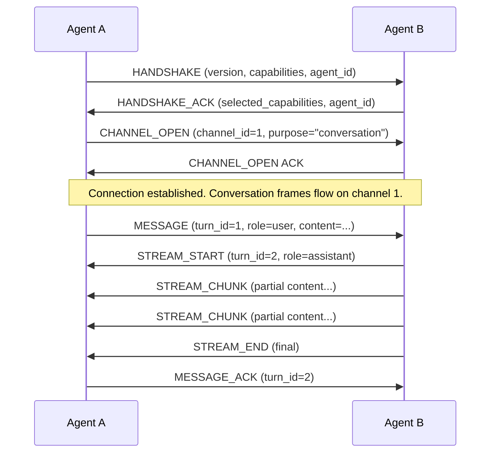

# DDAL Protocol Specification

> Distributed Dialog Abstraction Layer — a binary, conversation-native protocol for low-latency agent communication.

## Overview

DDAL is the wire protocol that DAF agents use to communicate. It treats conversations as first-class protocol primitives, not bolted-on metadata. Every frame carries conversation context — turn IDs, episode references, and channel information — so agents can maintain coherent multi-turn dialogues across network boundaries.

DDAL is not HTTP. It is not gRPC. It is purpose-built for the unique requirements of agent-to-agent communication where conversations are the fundamental unit of work.

## Design Goals

| Goal | Target |
|------|--------|
| Per-message overhead | < 100 us encode + decode |
| Multiplexed channels | Unlimited logical channels per connection |
| Conversation tracking | Native turn/episode/thread identifiers in every frame |
| Backpressure | Flow control per channel, not per connection |
| Transport agnostic | TCP, Unix sockets, TLS, in-process channels |
| Zero-copy friendly | Frame layout supports zero-copy deserialization |

## Frame Format

Every DDAL message is wrapped in a frame. The frame header is fixed at 24 bytes, followed by a variable-length payload.

```
 0                   1                   2                   3
 0 1 2 3 4 5 6 7 8 9 0 1 2 3 4 5 6 7 8 9 0 1 2 3 4 5 6 7 8 9 0 1
+-+-+-+-+-+-+-+-+-+-+-+-+-+-+-+-+-+-+-+-+-+-+-+-+-+-+-+-+-+-+-+-+
|    Version    |     Type      |           Flags               |
+-+-+-+-+-+-+-+-+-+-+-+-+-+-+-+-+-+-+-+-+-+-+-+-+-+-+-+-+-+-+-+-+
|                        Channel ID                             |
+-+-+-+-+-+-+-+-+-+-+-+-+-+-+-+-+-+-+-+-+-+-+-+-+-+-+-+-+-+-+-+-+
|                        Sequence Number                        |
+-+-+-+-+-+-+-+-+-+-+-+-+-+-+-+-+-+-+-+-+-+-+-+-+-+-+-+-+-+-+-+-+
|                      Conversation ID                          |
|                        (8 bytes)                              |
+-+-+-+-+-+-+-+-+-+-+-+-+-+-+-+-+-+-+-+-+-+-+-+-+-+-+-+-+-+-+-+-+
|                       Payload Length                           |
+-+-+-+-+-+-+-+-+-+-+-+-+-+-+-+-+-+-+-+-+-+-+-+-+-+-+-+-+-+-+-+-+
|                                                               |
|                         Payload                               |
|                          ...                                  |
+-+-+-+-+-+-+-+-+-+-+-+-+-+-+-+-+-+-+-+-+-+-+-+-+-+-+-+-+-+-+-+-+
```

### Field Descriptions

| Field | Size | Description |
|-------|------|-------------|
| Version | 1 byte | Protocol version. Currently `0x01`. |
| Type | 1 byte | Frame type (see below). |
| Flags | 2 bytes | Bitfield. Bit 0: compressed. Bit 1: encrypted. Bit 2: final frame in turn. |
| Channel ID | 4 bytes | Logical channel within the connection. |
| Sequence Number | 4 bytes | Monotonically increasing per channel. |
| Conversation ID | 8 bytes | UUID v7 truncated to 8 bytes. Links frames to a conversation. |
| Payload Length | 4 bytes | Length of the payload in bytes. Max 16 MiB. |
| Payload | Variable | Serialized message content. |

## Frame Types

| Type | Value | Direction | Description |
|------|-------|-----------|-------------|
| `HANDSHAKE` | `0x01` | Both | Connection initialization and capability negotiation |
| `HANDSHAKE_ACK` | `0x02` | Both | Handshake acknowledgment with selected capabilities |
| `MESSAGE` | `0x10` | Both | A conversation turn (the primary data frame) |
| `MESSAGE_ACK` | `0x11` | Both | Acknowledgment of a received message |
| `STREAM_START` | `0x20` | Sender | Begin a streaming response |
| `STREAM_CHUNK` | `0x21` | Sender | A chunk within a streaming response |
| `STREAM_END` | `0x22` | Sender | End of streaming response |
| `CHANNEL_OPEN` | `0x30` | Both | Open a new logical channel |
| `CHANNEL_CLOSE` | `0x31` | Both | Close a logical channel |
| `FLOW_CONTROL` | `0x40` | Both | Window update for backpressure |
| `PING` | `0xF0` | Both | Keepalive |
| `PONG` | `0xF1` | Both | Keepalive response |
| `ERROR` | `0xFF` | Both | Protocol-level error |

## Handshake Sequence



### Capability Negotiation

During handshake, each side advertises its capabilities as a bitfield:

| Bit | Capability | Description |
|-----|------------|-------------|
| 0 | `COMPRESSION` | Supports zstd payload compression |
| 1 | `ENCRYPTION` | Supports envelope-encrypted payloads |
| 2 | `STREAMING` | Supports streaming responses |
| 3 | `MULTIPLEXING` | Supports multiple logical channels |
| 4 | `CONVERSATION_RESUME` | Can resume conversations from a given turn |

The responder selects the intersection of both sides' capabilities.

## Channel Multiplexing

A single DDAL connection supports multiple logical channels. Each channel has:

- An independent sequence number space
- Independent flow control windows
- A designated purpose (conversation, control, telemetry)

This allows an agent to maintain multiple concurrent conversations over a single TCP connection without head-of-line blocking between conversations.

### Channel Lifecycle

1. Either side sends `CHANNEL_OPEN` with a proposed channel ID and purpose.
2. The other side acknowledges or rejects.
3. Messages flow on the channel with per-channel sequence numbers.
4. Either side can send `CHANNEL_CLOSE` to tear down the channel.
5. Channel IDs are not reused within a connection.

## Conversation Tracking

DDAL treats conversations as a core protocol concept. Every `MESSAGE` frame carries:

- **Conversation ID** — in the frame header. Groups all turns belonging to the same conversation.
- **Turn ID** — in the payload. Monotonically increasing within a conversation.
- **Parent Turn ID** — optional. For branching conversations (e.g., tool calls that spawn sub-conversations).
- **Episode ID** — optional. Links the conversation to a memory episode for recording.
- **Role** — `user`, `assistant`, `system`, `tool`.

This means conversation context is never lost at the protocol level, even when messages are routed through intermediary agents or load balancers.

## Serialization

The payload within a DDAL frame can use different serialization formats. The format is negotiated during handshake.

| Format | Use Case | Throughput | Human Readable | Size |
|--------|----------|------------|----------------|------|
| **bincode** | Default. Agent-to-agent. | ~2.5 GB/s encode | No | Smallest |
| **MessagePack** | Cross-language interop. | ~800 MB/s encode | No | Small |
| **JSON** | Debugging, external APIs. | ~200 MB/s encode | Yes | Largest |

DAF defaults to bincode for internal agent communication and MessagePack for cross-language scenarios. JSON is available for debugging and integration with external systems that expect it.

## Error Recovery

DDAL includes several strategies for handling failures:

### Connection-Level Recovery

- **Keepalives**: `PING`/`PONG` frames detect dead connections. Default interval: 15 seconds. Miss 3 in a row and the connection is considered dead.
- **Reconnection**: Agents attempt exponential backoff reconnection (1s, 2s, 4s, 8s, max 60s).
- **Conversation Resume**: If both sides support `CONVERSATION_RESUME`, the reconnecting agent sends the last known turn ID. The other side replays any turns after that point.

### Message-Level Recovery

- **Sequence Gaps**: If a receiver detects a gap in sequence numbers, it sends an `ERROR` frame requesting retransmission.
- **Acknowledgments**: `MESSAGE_ACK` frames confirm receipt. Unacknowledged messages are retransmitted after a timeout (default: 5 seconds).
- **Idempotency**: Messages carry sequence numbers. Duplicate deliveries are detected and deduplicated by the receiver.

### Channel-Level Recovery

- **Flow Control**: Each channel has a receive window. When the window is exhausted, the sender pauses until the receiver sends a `FLOW_CONTROL` update.
- **Channel Reset**: If a channel enters an inconsistent state, either side can close and reopen it without affecting other channels.

## Implementation

The DDAL codec lives in `crates/daf-ddal/`. Key modules:

- `frame.rs` — Frame encoding and decoding
- `codec.rs` — Tokio codec implementation for async I/O
- `channel.rs` — Channel multiplexing state machine
- `handshake.rs` — Connection handshake logic
- `conversation.rs` — Conversation tracking within the protocol layer

See also the FlatBuffers schema at `proto/ddal.fbs` for the canonical message definitions.
