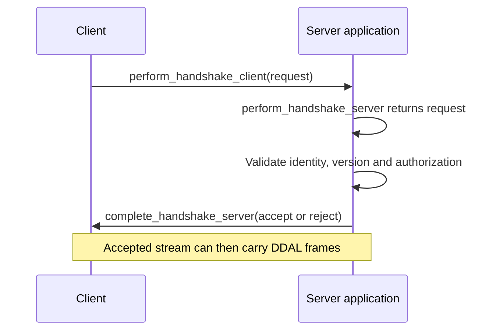

# DDAL wire protocol — 0.1.0

DDAL is DAF's binary framing and conversation-support library. The authoritative wire definition is [`protocol.rs`](../crates/daf-ddal/src/protocol.rs); the incremental Tokio adapter is [`codec.rs`](../crates/daf-ddal/src/codec.rs). This document describes current code, not a proposed protocol.

## Frame layout

All integer fields use network byte order. The fixed header is **21 bytes**.

| Offset | Bytes | Field |
| :--- | ---: | :--- |
| 0 | 4 | Magic: `DA F0 DD A1` |
| 4 | 1 | Major version |
| 5 | 1 | Minor version |
| 6 | 1 | Patch version |
| 7 | 1 | Frame type |
| 8 | 4 | Stream ID |
| 12 | 4 | Payload length |
| 16 | 1 | Flags |
| 17 | 4 | Truncated BLAKE3 checksum of header bytes 0–16 followed by payload |
| 21 | N | Payload, at most 16 MiB |

Current protocol version is `0.1.0`. Receivers check compatibility according to `ProtocolVersion::is_compatible_with`. The codec can impose a smaller maximum frame size. Encode checks actual payload length, declared length and checksum; malformed fields do not bypass the limit.

| Type | Value |
| :--- | :--- |
| Handshake | `0x01` |
| Data | `0x02` |
| Ack | `0x03` |
| Nack | `0x04` |
| Ping | `0x05` |
| Pong | `0x06` |
| Route | `0x07` |
| Subscribe | `0x08` |
| Unsubscribe | `0x09` |
| Close | `0x0A` |

Conversation UUIDs, turns and episode context are application/payload data. They are **not fixed frame-header fields**. A checksum is not a cryptographic identity check, signature or encryption layer.

## Incremental framing

`DdalCodec` decodes partial input through `tokio_util::codec`. Incomplete input waits for more bytes; invalid/oversized input returns an error. Applications must bound connections and deadlines as well as frames. Flags express metadata; setting a compression or fragmentation flag does not perform compression or reassembly automatically.

Invalid frame types and incompatible versions reject at header admission. An advertised payload length does not trigger allocation of the whole payload; buffering grows with received bytes. Raw serialization allocates from the actual payload, and codec encoding checks the declared length against it.

Payload helpers serialize Bincode, MessagePack and JSON. `detect_format` is a heuristic; applications should use an explicitly agreed format. The generic `Raw` helper currently uses Bincode; callers requiring truly raw bytes should supply `Bytes` directly as the frame payload.

## Connection handshake

The handshake helpers use a separate **four-byte length-prefixed Bincode message**, rather than `DdalCodec` framing. Choose one connection setup contract and use it consistently.


```mermaid
sequenceDiagram
  participant C as Client
  participant S as Server application
  C->>S: perform_handshake_client(request)
  S->>S: perform_handshake_server returns request
  S->>S: Validate identity, version and authorization
  S->>C: complete_handshake_server(accept or reject)
  Note over C,S: Accepted stream can then carry DDAL frames
```

`perform_handshake_server` returns a `HandshakeRequest` directly. Earlier releases returned a oneshot sender with no live receiver; that broken API has been replaced. Call `complete_handshake_server` after making the decision. Applications must enforce timeout and authentication themselves; the optional token field does not implement a verifier.

## Channels and transport

`ChannelPool` bounds logical channel count and queue capacity. A transport pump must take a channel's outbound receiver and deliver incoming frames through its writer. Opening a channel does not automatically create a network connection or task pump. Close releases capacity, wakes blocked queue sends and prevents stale cloned writers from sending. Claimed receivers drain queued frames and then reach EOF, including when the pool is dropped. Applications must manage the network pump lifecycle.

TCP provides ordered bytes and can still have head-of-line blocking across multiplexed logical streams. DDAL does not establish exactly-once delivery, durable acknowledgement, reconnection replay or cross-node consensus. Define these at the application layer before advertising them.

`daf-transport` provides TCP, Unix, in-process and rustls TLS components. Mutual TLS requires a CA and peer verification configuration; plain TCP is available and must not carry production secrets. The runtime does not automatically provide certificate management or authenticate every agent connection.

## Verification

```sh
cargo test --locked -p daf-ddal -p daf-transport
cargo test --locked -p daf-integration-tests --test remote_pipeline
```

The remote pipeline test uses a local deterministic fixture. It proves the named integration steps, not distributed production readiness or model quality. See [STANDARD.md](STANDARD.md) for delivery and security acceptance gates.
