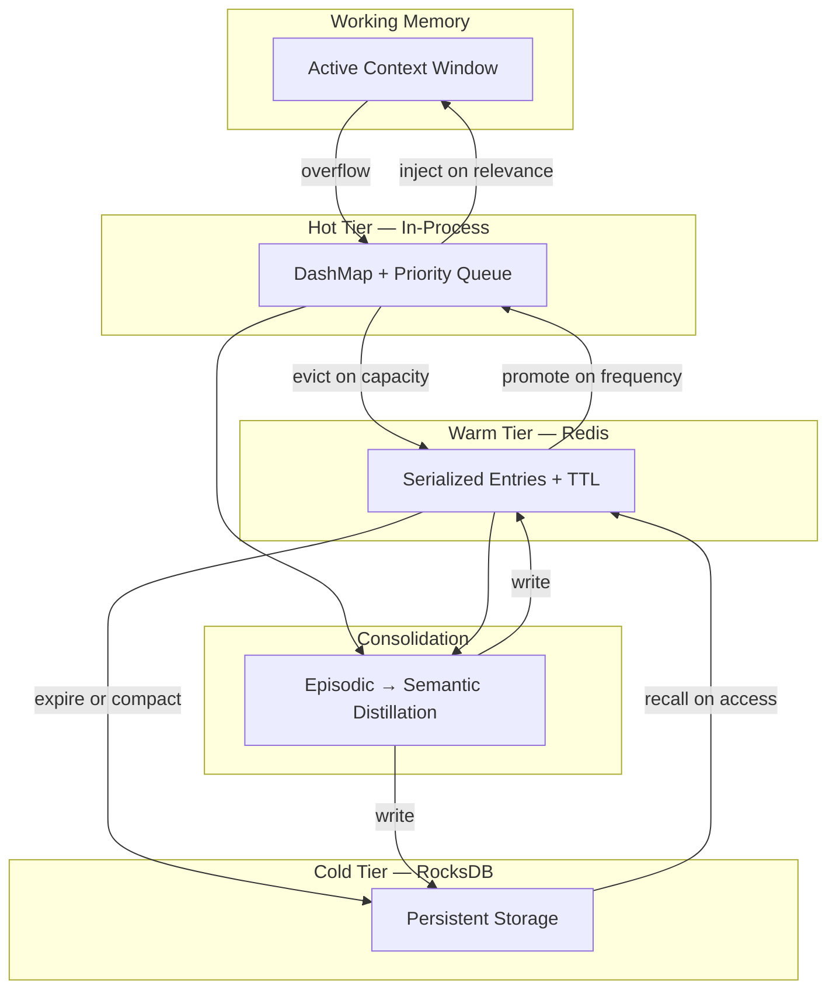
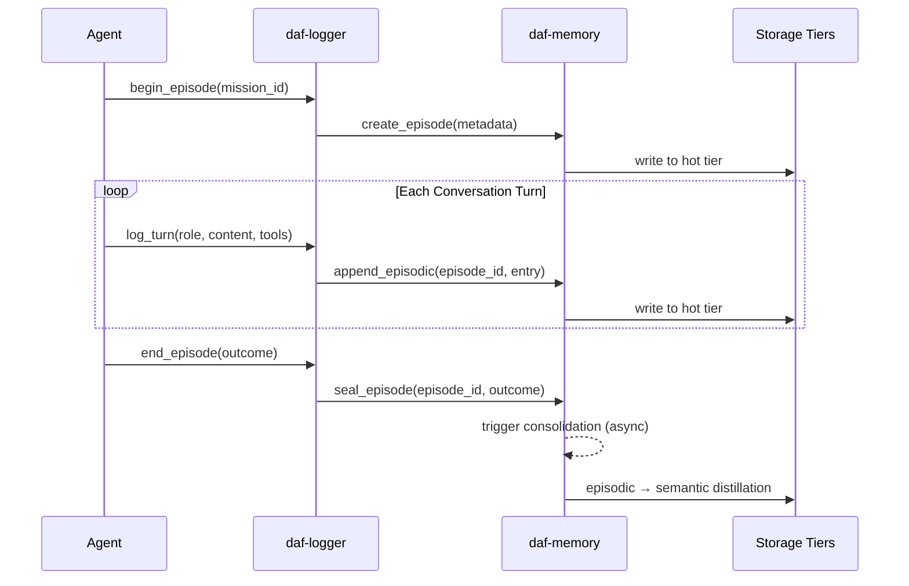

# Memory System

> Episode-based, three-tier memory for long-running agent systems.

## Overview

DAF's memory system gives agents the ability to remember, learn, and recall across conversations. It is not a simple key-value store. It models memory the way cognitive systems do: raw experiences are recorded as episodes, distilled into semantic knowledge over time, and procedural patterns are extracted for reuse.

The memory system lives in `crates/daf-memory/`.

## Architecture



## Memory Types

### Episodic Memory

Raw conversation recordings. Every turn, tool call, and result is captured as an episode entry with timestamps, agent IDs, and metadata.

```rust
EpisodicEntry {
    episode_id: Uuid,
    turn_id: u64,
    timestamp: DateTime<Utc>,
    agent_id: AgentId,
    role: Role,
    content: String,
    tool_calls: Vec<ToolCall>,
    metadata: HashMap<String, Value>,
}
```

Episodic memory is append-only. Episodes are never modified after recording.

### Semantic Memory

Distilled knowledge extracted from episodes. Facts, relationships, and learned patterns stored as structured entries with embedding vectors for similarity search.

```rust
SemanticEntry {
    id: Uuid,
    content: String,
    embedding: Vec<f32>,
    source_episodes: Vec<Uuid>,
    confidence: f32,
    created_at: DateTime<Utc>,
    access_count: u64,
    last_accessed: DateTime<Utc>,
    tags: Vec<String>,
}
```

### Procedural Memory

Reusable patterns: tool call sequences that worked, error recovery strategies that succeeded, multi-step workflows that agents discovered. Stored as executable templates.

```rust
ProceduralEntry {
    id: Uuid,
    pattern_name: String,
    trigger_conditions: Vec<Condition>,
    action_sequence: Vec<Action>,
    success_rate: f32,
    execution_count: u64,
    source_episodes: Vec<Uuid>,
}
```

### Working Memory

The active context window for a running agent. Not persisted — it exists only during a conversation. Working memory pulls from the other three types based on relevance to the current task.

## Three-Tier Storage

### Hot Tier — In-Process

- **Backend**: `DashMap` (concurrent hash map) with a priority queue for eviction.
- **Capacity**: Configurable, default 10,000 entries.
- **Eviction**: LRU with frequency boosting. Frequently accessed entries resist eviction.
- **Latency**: Sub-microsecond reads.

### Warm Tier — Redis

- **Backend**: Redis with serialized entries.
- **Capacity**: Bounded by Redis memory, typically 1-10 GB.
- **TTL**: Entries have a default TTL of 7 days, extended on access.
- **Latency**: Sub-millisecond reads on local Redis.

### Cold Tier — RocksDB

- **Backend**: RocksDB with column families per memory type.
- **Capacity**: Bounded by disk. Designed for millions of entries.
- **Compaction**: RocksDB's built-in compaction keeps read performance stable.
- **Latency**: Single-digit millisecond reads.

## Tier Promotion and Demotion

### Promotion Rules (Cold/Warm to Hot)

An entry is promoted when:

1. **Access frequency** exceeds the promotion threshold (default: 3 accesses within the TTL window).
2. **Recency** — accessed within the last hour and matching a current conversation's semantic context.
3. **Explicit recall** — an agent explicitly requests a memory by ID or semantic query that matches.

### Demotion Rules (Hot to Warm/Cold)

An entry is demoted when:

1. **Hot tier full** — LRU eviction pushes the least-recently-used entry to warm.
2. **Warm TTL expires** — entries not accessed within the TTL window move to cold.
3. **Manual archival** — the orchestrator marks an episode as completed and archives it to cold.

### Boost Mechanism

Entries can receive a "boost" that temporarily increases their priority in the hot tier:

- **Relevance boost**: When an entry's embedding is similar to the current conversation context.
- **Recency boost**: Decays exponentially over time (half-life: 1 hour).
- **Frequency boost**: Logarithmic scaling based on access count.

The effective priority is: `base_priority + relevance_boost + recency_boost + ln(access_count + 1)`

## Episode Recording Lifecycle



### States

1. **Recording** — Episode is active. Turns are being appended.
2. **Sealed** — Episode is complete. No more turns will be added. Consolidation is triggered.
3. **Consolidated** — Semantic entries have been extracted. Episodic data is archived to cold.
4. **Archived** — Episode is in cold storage. Accessible but not in hot or warm tiers.

## Consolidation Algorithm

Consolidation is the process of distilling episodic memories into semantic knowledge. It runs asynchronously after an episode is sealed.

### Steps

1. **Extract facts**: Parse conversation turns for declarative statements, decisions, and outcomes.
2. **Deduplicate**: Compare extracted facts against existing semantic entries using embedding similarity (threshold: 0.92).
3. **Merge or create**: If a similar semantic entry exists, merge and increase confidence. Otherwise, create a new entry.
4. **Extract procedures**: Identify tool call sequences that led to successful outcomes. Store as procedural entries.
5. **Update links**: Link new semantic/procedural entries back to the source episode.
6. **Archive episode**: Demote the episodic data to cold tier.

### Conflict Resolution

When consolidation finds conflicting information (e.g., a new fact contradicts an existing semantic entry):

- If the new episode is more recent and from a higher-authority agent, the old entry's confidence is reduced.
- If confidence drops below a threshold (default: 0.3), the entry is marked as deprecated.
- Both entries are kept — nothing is deleted. The confidence score determines which is used during recall.

## KB Extraction from Conversation Logs

The logger can extract structured knowledge base entries from conversation logs:

1. **Summaries**: One-paragraph summary of what the conversation accomplished.
2. **Decisions**: Key decisions made during the conversation with rationale.
3. **Artifacts**: Files created, commands run, configurations changed.
4. **Learnings**: What worked, what did not, and why.

These are stored as semantic entries with the tag `kb_extraction` and linked to the source episode.

## Configuration

```toml
[memory]
# Hot tier
hot_capacity = 10000
hot_eviction = "lru-frequency"

# Warm tier
warm_backend = "redis"
warm_url = "redis://localhost:6379/0"
warm_ttl_seconds = 604800  # 7 days
warm_max_memory = "2gb"

# Cold tier
cold_backend = "rocksdb"
cold_path = "./data/memory"

# Consolidation
consolidation_enabled = true
consolidation_delay_seconds = 30
similarity_threshold = 0.92
min_confidence = 0.3

# Boost parameters
relevance_boost_weight = 1.0
recency_half_life_seconds = 3600
frequency_boost_scale = 1.0

# Promotion
promotion_access_threshold = 3
promotion_recency_window_seconds = 3600
```

All values have sensible defaults. For development, memory works with just the hot tier — Redis and RocksDB are optional.
