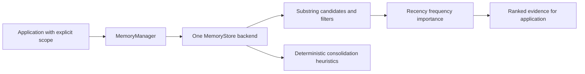

# Memory in DAF

DAF provides typed memory records, interchangeable storage backends, recall, lifecycle metadata and deterministic consolidation helpers. These are building blocks for an application memory system; they are not a trained cognitive architecture.

## Stores and records

`MemoryStore` has async store/retrieve/update/delete/search/list/metrics operations. Implementations are `InMemoryStore` (ephemeral), `SledStore` and `RocksStore` (embedded persistence). Records carry an ID, JSON content, kind, tier, timestamps, source agent, tags, importance and access metadata. Application authorization must scope access to records.

Kinds are episodic, semantic, procedural and working. A **semantic kind label does not mean embedding search or learned fact extraction**. Hot/warm/cold are record metadata. `MemoryManager` wraps a single store and changes labels; it does not migrate records across three independent physical databases.


```mermaid
flowchart LR
  App[Application with explicit scope] --> Manager[MemoryManager]
  Manager --> Store[One MemoryStore backend]
  Store --> Recall[Substring candidates and filters]
  Recall --> Ranking[Recency frequency importance]
  Ranking --> Evidence[Ranked evidence for application]
  Store --> Consolidate[Deterministic consolidation heuristics]
```

## Recall

Content search matches case-insensitive substrings in serialized content. Recall applies source-agent, kind, tier, tags, time-range, importance and expiry filters before ranking and truncating. Strategies prioritize recency, access count, importance or a weighted composite. This is not semantic/vector similarity.

The current implementation scans all candidates so ranking/filtering remains correct. That can consume substantial time/memory on large databases. Bounded indexed queries and explicit retrieval budgets are required for high-scale deployment. Do not equate a small result limit with bounded candidate work.

## Lifecycle

The default manager thresholds promote warm to hot after 10 accesses and cold to warm after 3. Demotion defaults are 24 hours for hot and 168 hours for warm; importance decay defaults to a 168-hour half-life. These are configurable policies, not measured cognitive properties. Expired memories are excluded from recall even before compaction removes them.

Episodes record observations. Consolidation distills content heuristically and compares word overlap with Jaccard similarity. It preserves merge tags/source metadata and updates a retained record before deleting a replaced record. Multi-record operations are not a cross-backend transaction, so crash recovery and application-level conflict review remain requirements.

## Evidence and trust

Applications should retain original source references, ownership, versions and timestamps in memory metadata/content. Derived summaries must remain attributable and reviewable. Retrieved content is untrusted evidence, not authorization to invoke tools or override current user instructions. DAF does not presently enforce all of those policies for callers.

Do not advertise contradiction resolution, learned procedural discovery, embedding indexes or a durable distributed memory service until a real implementation and retrieval-quality evaluation establish them.

## Verification

```sh
cargo test --locked -p daf-memory -p daf-logger
cargo test --locked -p daf-integration-tests --test remote_pipeline
```

The test suite covers backend persistence, expiry, filtering/ranking, episodes and consolidation behavior. It does not establish factual accuracy of model-generated memories or crash consistency of every multi-record workflow. See [the engineering standard](STANDARD.md) for the acceptance gates.

Sled writes are buffered. `SledStore::flush().await` is an explicit persistence fence; the TCP acceptance fixture flushes before acknowledging its result. Reopen tests exercise graceful persistence, not power-loss fault injection or multi-record atomicity.
