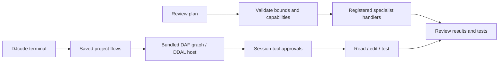

# Specialist execution across DAF, DDAL and DJcode

Created by Darshankumar Joshi. A useful agent team needs explicit work, registered
capabilities, bounded resources, permission checks and evidence of completion.
Adding more prompt profiles alone does not supply these guarantees.

| Layer | Runs today | Caller responsibility |
| --- | --- | --- |
| DAF `SpecialistPlan` | Validated JSON assignments through registered workers; capability admission before dispatch; dependency success gates | Worker provisioning, model selection, safe handlers, result evaluation |
| DAF CLI | Local argv graph, dry-run waves, concurrency 1–64, task deadlines, ordered JSON outcomes | Review commands; control detached descendants |
| DAF durable remote worker | Scoped authentication, persistent prepared results and stable UUID replay | TLS off loopback; use prepared pure results or transactional downstream consumers |
| DDAL | Incremental binary framing, bounded queues and explicit channel pumping | Authentication, deadlines, network lifecycle and application acknowledgement |
| DJcode | Terminal/REPL, saved project teams, DAF graph scheduling through DDAL, per-tool approvals, recoverable sessions | Choose provider, review tool calls, inspect changed files and run meaningful tests |



## Run the Rust example

```sh
cargo run --locked -p daf-orchestrator --example specialist_plan
```

The [source](../crates/daf-orchestrator/examples/specialist_plan.rs) registers three
capabilities and prints actual handler calls in dependency order. JSON uses
`timeout_secs`, `required_capabilities`, `depends_on` and optional `max_retries`
(default zero). Defaults admit 32 assignments, a 1 MiB plan, one-hour mission
deadline and three retries. Missing registered capabilities reject the complete
plan before invoking a worker. Preflight is a snapshot rather than a reservation;
later shutdown or worker removal can still fail execution.

Assignments in this API execute sequentially. Handler output is not automatically
fed into later assignments. Use the durable remote dependency API for recovered
result consumption, or pass application context explicitly. Retrying a handler
does not make its external side effects exactly once.

## Use the coding terminal

DJcode bundles a local DAF core/graph/DDAL snapshot. It does not automatically
inherit every newer DAF runtime feature. Its saved flows admit at most 32 nodes
and run with concurrency 1–4; model tool effects are not automatically retried.
See [Project studio](https://github.com/darshjme/djcode/blob/main/docs/PROJECT-STUDIO.md)
for agent, organisation and flow examples. Approval callbacks remain in the
current terminal session.

Capability and correctness are measured with executed fixtures and user-selected
checks. None of these mechanisms establishes AGI, ASI, autonomous scientific
discovery or professional credentials for named specialist profiles.
